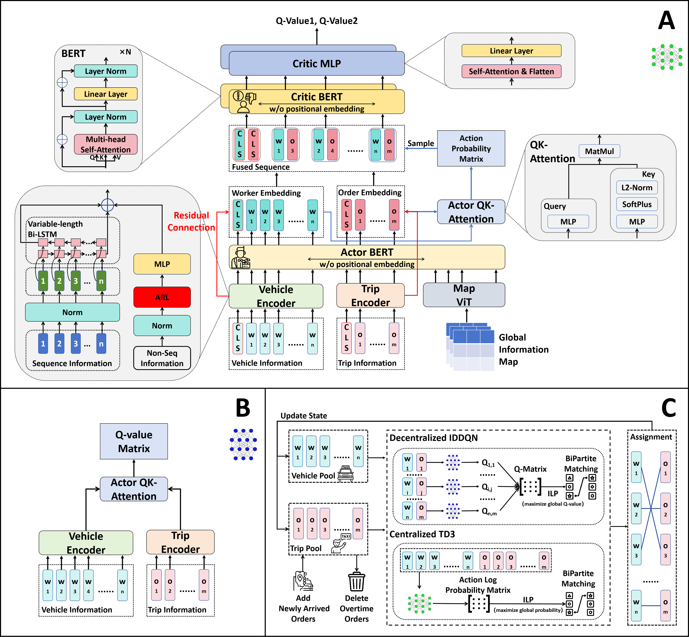

# MA2SA

**Article:** Zijian Zhao, Sen Li*, "A Centralized Reinforcement Learning Framework for Large-Scale Dynamic Trip-Vehicle Assignment" (under way)

Expanded version of [RS2002/Triple-BERT: Official Repository for The Paper, Triple-BERT: Do We Really Need MARL for Order Dispatch on Ride-Sharing Platforms?](https://github.com/RS2002/Triple-BERT).

## 1. Workflow



## 2. Tasks

1. ride sharing
2. ambulance dispatch

## 3. Simulator

Please refer to [RS2002/Triple-BERT: Official Repository for The Paper, Triple-BERT: Do We Really Need MARL for Order Dispatch on Ride-Sharing Platforms?](https://github.com/RS2002/Triple-BERT).

## 4. References

```

```

